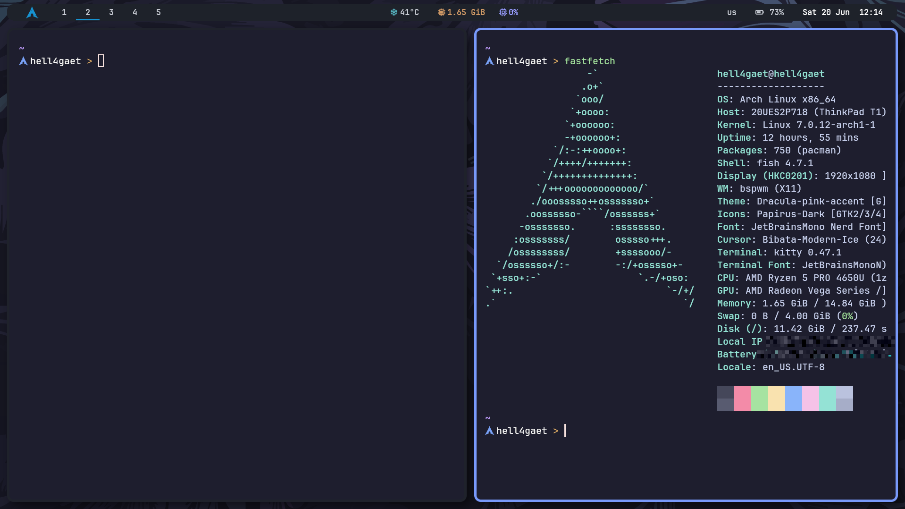

# HELL4GAET Arch BSPWM dotfiles

Лёгкий X11-десктоп для Arch Linux: BSPWM, SXHKD, Polybar, Rofi, Picom,
PipeWire, NetworkManager и Bluetooth. Конфигурация адаптирована для ноутбука и
внешнего 4K-монитора.

## Демонстрация



## Быстрая установка

На новой установленной Arch Linux должен работать интернет, а пользователь
должен иметь доступ к `sudo`.

```bash
sudo pacman -Syu --needed git base-devel
git clone https://github.com/HELL4GAET/HELL4GAET-arch-bspwm-dotfiles.git
cd HELL4GAET-arch-bspwm-dotfiles
./install.sh
```

`./install.sh` запускает интерактивный мастер. Для обычной установки принимай
предложенные по умолчанию ответы:

1. установить основные пакеты рабочего стола;
2. установить desktop integration;
3. установить CLI-инструменты;
4. установить обязательные AUR-пакеты;
5. установить dotfiles;
6. включить системные сервисы.

Дополнительные developer tools и GoLand устанавливаются только по отдельному
подтверждению. Go входит в основной профиль.

После завершения перезагрузи систему:

```bash
reboot
```

Войди под своим пользователем на `tty1`. `~/.bash_profile` автоматически
запустит `startx` и BSPWM. На других TTY графическая сессия не запускается.

Терминал открывается через `Super+Enter`, меню приложений через `Super+D`.

## Рекомендуемые настройки archinstall

Запускай `archinstall` из актуального официального Arch Linux ISO. Перед
запуском подключи интернет; Wi-Fi при необходимости настраивается через
`iwctl`.

Для чистой установки под этот репозиторий рекомендуется:

- `Disk configuration`: автоматическая разметка свободного диска или ручная
  разметка, если рядом уже установлена другая ОС; файловая система `btrfs` или
  `ext4`;
- `Bootloader`: `systemd-boot` для обычной UEFI-установки, `GRUB` или `Limine`
  для BIOS и специфических multiboot-сценариев;
- `Swap`: включить;
- `Hostname`: любое удобное имя;
- `Root password`: по желанию;
- `User account`: создать обычного пользователя и дать ему `sudo`;
- `Profile`: `Minimal`, без Desktop/Window Manager profile;
- `Audio`: можно не выбирать, потому что installer поставит PipeWire и
  WirePlumber;
- `Network configuration`: `NetworkManager`;
- `Kernels`: стандартный `linux`; `linux-lts` можно добавить вторым;
- `Additional packages`: оставить пустым;
- `Timezone`, locale и keyboard layout: выбрать свои; X11-раскладки позже
  настроит этот репозиторий.

После завершения `archinstall` загрузись в установленную систему, войди обычным
пользователем и выполни команды из раздела «Быстрая установка». Не выбирай в
`archinstall` готовый Desktop/BSPWM profile: пакеты и конфиги рабочего стола
должны устанавливаться `./install.sh`, чтобы не получить конфликтующие настройки.
Актуальные названия и ограничения параметров описаны в
[официальной документации archinstall](https://archinstall.archlinux.page/installing/guided.html).

## Установка одной командой

Основной сценарий одной командой:

```bash
./install.sh --all
```

Он устанавливает основные пакеты, desktop integration, CLI tools, обязательные
AUR-пакеты, dotfiles и сервисы. Пароль `sudo` всё равно потребуется.

Доступные отдельные этапы:

```bash
./install.sh --check
./install.sh --packages
./install.sh --integration
./install.sh --cli
./install.sh --aur
./install.sh --dotfiles
./install.sh --doctor
./install.sh --dry-run --all
./install.sh --update
./install.sh --restore
./install.sh --uninstall
./install.sh --cleanup
./install.sh --services
./install.sh --dev
./install.sh --goland
./install.sh --docker
./install.sh --go
./install.sh --rust
./install.sh --jdk
./install.sh --browser-firefox
./install.sh --browser-chromium
./install.sh --help
```

Если `yay` отсутствует, этап `--aur` соберёт его из официального AUR.

## Что устанавливается

Основной рабочий стол:

- BSPWM, SXHKD, Polybar, Picom, Rofi и Dunst;
- Kitty с Fish и кастомным prompt; Fastfetch доступен для ручного запуска;
- Neovim с LazyVim, готовым Go LSP, форматированием, lint, тестами, DAP и Git;
- PipeWire, WirePlumber, Pavucontrol и управление громкостью;
- NetworkManager, Blueman и Bluetooth;
- Thunar, Chromium, Firefox, Code OSS, Telegram Desktop, MPV и Flameshot;
- JetBrainsMono Nerd Font, Noto Fonts и Papirus;
- единая непрозрачная палитра Catppuccin для Kitty и Rofi;
- белый курсор `Bibata-Modern-Ice`;
- Chromium как обработчик HTML/HTTP/HTTPS по умолчанию, Firefox отдельным
  быстрым запуском;
- lockscreen через `i3lock-color`;
- GTK-тема `Dracula-pink-accent`;
- Polkit-agent, автоматическое подключение накопителей и интеграция Thunar с
  MTP, SMB, архивами, thumbnails и корзиной;
- idle locking перед DPMS/suspend через `xss-lock`;
- ручной тёплый режим экрана через `redshift`;
- CLI-набор `fzf`, `fd`, `bat`, `eza`, `zoxide`, `jq`, `lazygit`,
  `git-delta`, `direnv`, `tealdeer`, `dust`, `duf`, `ncdu` и `trash-cli`.

Опционально мастер может установить:

- дополнительные developer tools: Rust, Node.js, Python, JDK, Docker,
  GitHub CLI;
- GoLand;

Профили браузеров, SSH-ключи, VPN, Telegram session, JetBrains license,
кэши и пароли в репозиторий не входят.

Git identity намеренно не устанавливается. После установки задай собственные
значения:

```bash
git config --global user.name "Your Name"
git config --global user.email "you@example.com"
```

Скрипты рабочего стола также явно устанавливают `libnotify`,
`nm-connection-editor` и `xdg-utils`, необходимые для уведомлений, управления
сетевыми подключениями и открытия URL.

## Безопасность установки

Перед заменой существующих файлов установщик переносит их в:

```text
~/.dotfiles-backup/YYYYMMDD-HHMMSS/
```

Проверить действия без изменения системы:

```bash
./install.sh --dry-run --all
```

Обновить dotfiles с новым backup или восстановить последний backup:

```bash
./install.sh --update
./install.sh --restore
```

`--uninstall` переносит управляемые файлы в safety-backup. Их список хранится
в `~/.local/state/hell4gaet-dotfiles/manifest`.

Установщик нужно запускать обычным пользователем. Запуск от `root` запрещён.

`base-devel` входит в основной набор и предоставляет C compiler, необходимый
для сборки Treesitter parsers в Neovim.

После копирования автоматически определяются:

- Wi-Fi интерфейс;
- backlight device;
- батарея;
- AC/USB power adapter.

Найденные значения записываются в установленный
`~/.config/polybar/modules.ini`.

## Графический вход

Display manager не используется. После обычного входа на `tty1`
`~/.bash_profile` запускает `startx`; `.xinitrc` запускает BSPWM. Для ручного
запуска из другого TTY используй команду `startx`.

## Мониторы и HiDPI

`Super+Shift+M` переключает активный экран:

- внутренний экран → внешний;
- внешний экран → внутренний.

Одновременно используется только один экран. Скрипт находится здесь:

```text
~/.config/bspwm/scripts/monitor-switch.sh
```

Профиль ноутбука:

- родное разрешение;
- `Xft.dpi=120`;
- Qt scale `1`;
- курсор `24`;
- Polybar `1886x34+16+10`;
- отступы BSPWM `top=44`, `bottom=0`.

Профиль внешнего монитора:

- `3840x2160@60`, с fallback на `xrandr --auto`;
- `Xft.dpi=168`;
- Qt scale `1.75`;
- курсор `32`;
- Polybar `3806x46+16+12`;
- отступы BSPWM `top=58`, `bottom=0`.

При переключении рабочие столы `1-5` переносятся на активный монитор,
выключаются все неактивные RandR-выходы, включая зависшие `disconnected`
выходы с сохранённой геометрией, перезапускается Polybar, повторно применяются
обои и перечитывается конфигурация Dunst. SXHKD не перезапускается.

Проверка:

```bash
xrandr --query
bspc query -M --names
cat ~/.cache/monitor-profile
pgrep -a polybar
pgrep -a sxhkd
```

Логи:

```text
~/.cache/monitor-switch.log
/tmp/monitor-switch-polybar.log
/tmp/polybar-<monitor>.log
```

## Polybar

Слева находятся увеличенный фирменный значок Arch Linux `#1793D1` и рабочие
столы, в центре температура, память и CPU. Активный workspace выделяется жирной
цифрой и синей нижней линией, занятые workspace ярче пустых, срочные workspace
получают красную нижнюю линию без фонового квадрата.

Справа отображаются батарея, день недели, дата и время, например
`us    84%  Sun 14 Jun  10:35`. Индикатор раскладки показывает `us` или `ru`
и обновляется при переключении через `Alt+Shift`. Звук и яркость управляются
аппаратными клавишами, поэтому их постоянные индикаторы скрыты из панели.

Фон Polybar полностью непрозрачный, внешняя граница отключена. Панель сохраняет
скругление и отдельные размеры для ноутбука и внешнего 4K-монитора.

Общий system tray отключён, поэтому иконки запущенных приложений в Polybar не
попадают. Синий значок Arch Linux слева открывает powermenu. Управление Wi-Fi
и Bluetooth вынесено в отдельные терминальные команды:

```bash
wifi
bluetooth
```

`wifi` открывает редактор сетевых подключений NetworkManager,
`bluetooth` — графический менеджер устройств Blueman.

## Picom

Picom настроен на полностью непрозрачный визуальный слой:

- backend `glx`;
- VSync включён;
- мягкие тени включены;
- blur отключён;
- fading отключён, чтобы show/hide/focus/workspace changes были мгновенными;
- активные и неактивные окна имеют opacity `1.0`, затемнение отключено;
- скругления `14 px`.

Рамки окон задаёт BSPWM: `border_width=5`. Активная рамка фиолетовая,
сфокусированная — синяя; Picom отображает рамки полностью непрозрачными через
`frame-opacity=1.0`.

## Kitty, Fish и GoLand

`Super+Enter` открывает Kitty. Alacritty не используется и не устанавливается.
Kitty запускает Fish, использует непрозрачную палитру Catppuccin, скрытые
декорации, powerline tabs и небольшой cursor trail. В Kitty `Ctrl+V` вставляет
содержимое системного clipboard, а правый клик выделяет вывод shell-команды.

Fish prompt показывает текущий путь, git branch, значок Arch Linux и текущего
пользователя. Fastfetch установлен, но автоматически при старте Kitty не
запускается; при необходимости выполни `fastfetch` вручную.

GoLand 2026.1 настроен на Fish во встроенном терминале через:

```text
~/.config/JetBrains/GoLand2026.1/options/terminal-local.xml
```

Также устанавливаются светлая тема интерфейса GoLand, светлая цветовая схема
редактора, compact UI и HiDPI editor/terminal fonts для внешнего 4K-профиля.
Code OSS использует тему `Light Modern`.

## CLI-инструменты

После установки открой новый Fish или выполни `exec fish`.

- `fzf` — интерактивный fuzzy-поиск. `Ctrl+R` ищет команду в history,
  `Ctrl+Alt+F` вставляет найденный путь, `Ctrl+Alt+L` выбирает каталог.
- `fd pattern [path]` — быстрый поиск файлов: `fd config ~/.config`.
  В интерактивном Fish команда `find` является alias на `fd`.
- `bat file` — просмотр файла с подсветкой и номерами строк. Интерактивный
  `cat` использует `bat --paging=never`.
- `eza` — современный `ls`: `ls`, `ll`, `tree`, либо напрямую
  `eza -lah --git`.
- `zoxide` — запоминает часто используемые каталоги: `z projects`,
  `z finance`, `zi` для интерактивного выбора.
- `jq` — обработка JSON: `jq . file.json`,
  `curl -s URL | jq '.items[]'`.
- `lazygit` — полноэкранный Git UI. Запусти `lazygit` внутри репозитория;
  клавиша `?` показывает бинды.
- `delta` — форматирует Git diff. Использование напрямую:
  `git diff | delta`; глобальную настройку можно включить командой
  `git config --global core.pager delta`.
- `direnv` — проектные переменные окружения. Создай `.envrc`, например
  `export APP_ENV=dev`, затем выполни `direnv allow`.
- `tldr command` — короткие практические примеры: `tldr tar`.
  Пакет называется `tealdeer`, команда — `tldr`.
- `dust path` — наглядный размер каталогов. В Fish команда `du` использует
  `dust`.
- `duf` — таблица файловых систем и свободного места. В Fish команда `df`
  использует `duf`.
- `ncdu path` — интерактивный анализ занятого места с навигацией клавишами.
- `trash-put file`, `trash-list`, `trash-restore`, `trash-empty` — безопасное
  удаление и управление корзиной.
- `shellcheck script.sh` — статический анализ shell-скрипта.
- `shfmt -w script.sh` — форматирование shell-скрипта.

## Neovim и LazyVim

Installer копирует переносимую конфигурацию из `config/nvim` в
`~/.config/nvim`. В репозитории хранятся только конфиги и lockfile плагинов;
скачанные плагины, swap, undo, сессии и прочее runtime-состояние не хранятся.
Пустой `lua/plugins/init.lua` оставлен как безопасная точка для будущих
локальных plugin specs.

Первый запуск:

```bash
nvim
```

LazyVim автоматически установит плагины из `lazy-lock.json`. Карта основных
биндов и настройки Go находятся в [docs/keybindings.md](docs/keybindings.md).
Проверка орфографии подготовлена для английского и русского словарей через
`spelllang=en,ru`; включить её для текущего окна можно командой `:set spell`.

Включены extras:

- `lang.go` — `gopls`, Go Treesitter, `goimports`, `gofumpt` и
  `golangci-lint`;
- `dap.core` — отладка через Delve;
- `test.core` — Go tests через Neotest;
- `lang.git` — поддержка Git-конфигов и commit messages.

Mason устанавливает `gopls`, `goimports`, `gofumpt`, `golangci-lint` и `delve`
при первом запуске. Для этого нужны интернет, `unzip` и C compiler из
`base-devel`.
Проверить состояние можно командами `:Lazy`, `:Mason` и `:LspInfo`.

LazyGit уже входит в CLI-набор и открывается в Neovim через `<leader>gg`.

## Пользовательская systemd-сессия

`~/.xinitrc` перед запуском BSPWM передаёт X11 environment в user manager.
BSPWM затем запускает `bspwm-session.target`, связанный с
`graphical-session.target`. Это даёт пользовательским systemd-сервисам
корректный жизненный цикл графической сессии.

Unit устанавливается в:

```text
~/.config/systemd/user/bspwm-session.target
```

## Клавиатура и раскладки

Используются раскладки `us,ructrl`, переключение выполняется через
`Alt+Shift`. В русской раскладке сочетания с физическим `Ctrl` используют
латинские буквы, поэтому `Ctrl+C`, `Ctrl+V`, `Ctrl+X` и другие shortcut работают
без ручного переключения на английский.

Caps Lock остаётся обычным Caps Lock и не переназначается в Ctrl. Базовый
`keyd`-профиль преобразует аппаратную клавишу `Fn` в `F13`. Дополнительный
профиль `config/keyd/ajazz-nk68.conf` применяется к Ajazz NK68 v2
(`36ae:feab`) и делает `Fn+-` уменьшением громкости, а `Fn+=/+` увеличением.

## Rofi и powermenu

Rofi использует непрозрачную тему Catppuccin и увеличенный HiDPI-шрифт во
внешнем 4K-профиле. `Super+D` открывает меню приложений, `Super+Shift+D` — run
prompt, `Super+Shift+Enter` — переключатель окон. Powermenu открывается через
`Super+Shift+X` или левый значок Arch Linux в Polybar.

`theme-from-wallpaper` повторно применяет закреплённые шаблоны Kitty и Rofi
через Matugen. Палитра намеренно фиксирована и не меняется от выбранных обоев.

## Обои

Применить текущую:

```bash
wallpaper
```

Выбрать случайную из `~/.config/bspwm/wallpapers`:

```bash
wallpaper --random
```

## Тёплый режим экрана

Тёплый режим управляется только из терминала:

- normal: `6500K`;
- warm: `4200K`.

Нет расписания, геолокации и постоянно работающего Redshift-процесса:

```bash
warm-screen toggle
warm-screen status
```

`warm-screen toggle` переключает между `4200K` и `6500K`. После входа в новую
графическую сессию команда запускается вручную.

## Основные клавиши

```text
Super+Enter          терминал
Super+D              приложения
Super+Shift+D        запуск команды
Super+Shift+Enter    список окон
Super+Shift+F        Firefox
Super+Shift+G        Chromium
Super+Q              закрыть окно
Super+1..5           рабочие столы
Super+Shift+1..5     перенести окно
Super+H/J/K/L        фокус
Super+Shift+H/J/K/L  обмен окон
Super+Shift+M        переключить монитор
Print                Flameshot
```

Полный список: [docs/keybindings.md](docs/keybindings.md).

## Проверка после установки

```bash
./install.sh --doctor
```

Команда проверяет пакеты, runtime-команды, шрифты, hardware detection,
shell/Fish-скрипты, конфигурацию `keyd`, дисплей и display manager.

Проверки репозитория:

```bash
make lint
make check
make dry-run
make doctor
```

- `make lint` запускает ShellCheck и проверяет форматирование через shfmt;
- `make check` запускает smoke-тесты installer и конфигов;
- `make dry-run` показывает полную установку без изменений;
- `make doctor` проверяет текущую систему.

GitHub Actions автоматически выполняет `make lint` и `make check` при push и
pull request.

Также полезно проверить:

```bash
systemctl status NetworkManager bluetooth keyd
systemctl --user status pipewire pipewire-pulse wireplumber
command -v bspwm sxhkd polybar picom rofi
```

Если Polybar не показывает устройство, проверь:

```bash
ip -brief link
ls /sys/class/backlight
ls /sys/class/power_supply
```

и соответствующие секции в `~/.config/polybar/modules.ini`.
